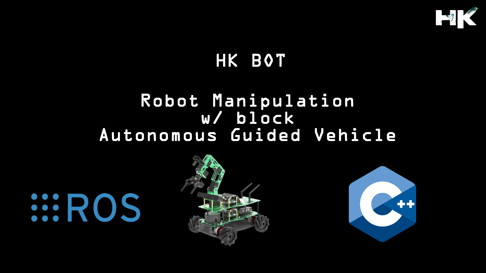
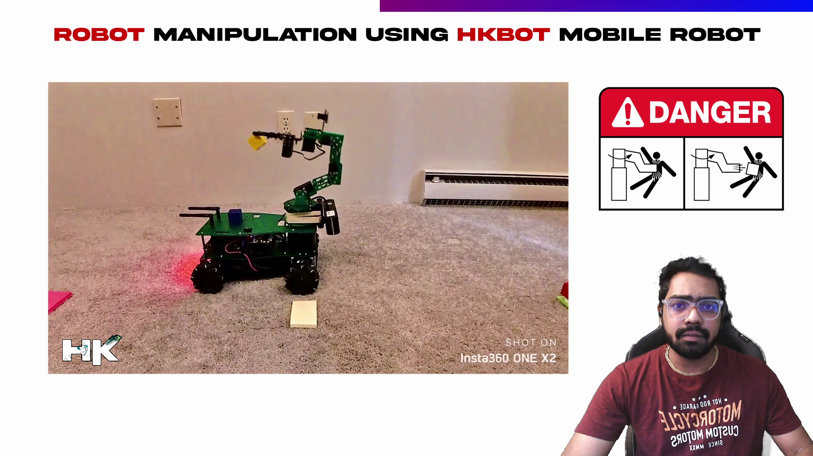
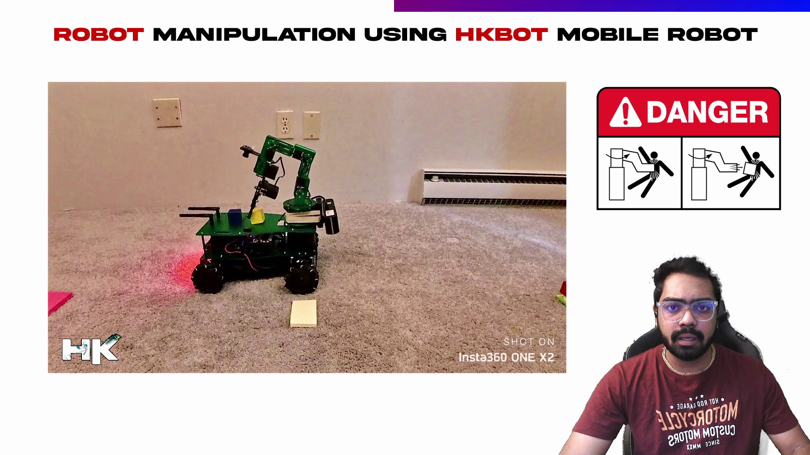

# Mobile Robot Manipulation w/ Blocks

  

---------------------------------------------

## About this Project:
I have developed a specialized algorithm for a custom-built mobile robot that utilizes an NVIDIA Jetson Nano and a 6-DOF robotic arm for block manipulation tasks. The robot is designed with mecanum wheels, which enable omnidirectional movement, allowing the robot to maneuver with precision in any direction. Safety protocols and measures have been rigorously integrated to ensure the robot operates within the guidelines for mobile robots and autonomous guided vehicles. 

The algorithm efficiently manages the 'pick and place' operations, placing blocks onto the robot's chassis, adapting dynamically to the payload configuration, and optimizing the spatial arrangement to accommodate additional blocks.

  

---------------------------------------------

  

---------------------------------------------

## Manipulation Planning Sequence:
I have designed the algorithm for the robotic arm in a way that is referred to as 'manipulation sequence' or 'manipulation planning' in robotics. When the robot's chassis already holds one or two blocks, it needs space to place an additional block. My developed algorithm directs the arm to push the existing blocks slightly backward, creating room for the new one. This process can repeat for any number of blocks, as demonstrated in the video.

---------------------------------------------

## Implemented Safety Measures for Operating AMRs/AGVs:

As we all know, robots can pose a hazard if we enter their operational zone. To address safety concerns on sites and factories that use mobile robots and Autonomous Guided Vehicles (AGVs), I have programmed an algorithm to enhance safety communications. When the robot is performing a manipulation task, it emits a flashing red light. Conversely, when the robot is merely moving around, it emits a green light, signaling to humans that it is safe to approach. However, it is unsafe to approach when the robot flashes a red light.

### Green - Safe

  

---------------------------------------------

### Red - Unsafe

  

---------------------------------------------

## My Project Video Demonstration:

  

---------------------------------------------
